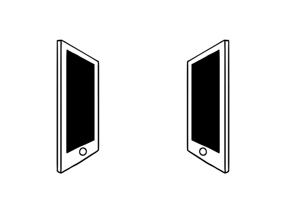

# Hi, I'm Olga 👋

**Software engineering student and aspiring game designer with  
a focus on OOP and clean code.**

Interested in building fun, interactive, and beautiful games  
(*unity/game designer/level designer*).

## My Skill Set  
<table><tr><td valign="top" width="20%">

### Frontend  

  
  
  
  

</td><td valign="top" width="33%">

### Backend  

  
  
  
  
  
  

</td><td valign="top" width="33%">

### GameDev  

  
  
  
  

</td></tr></table> 

## Connect with me  

  

 
 

  

  
<b>:gear: &nbsp;GitHub Statistics</b>

   
    

        
    

    

         
    

